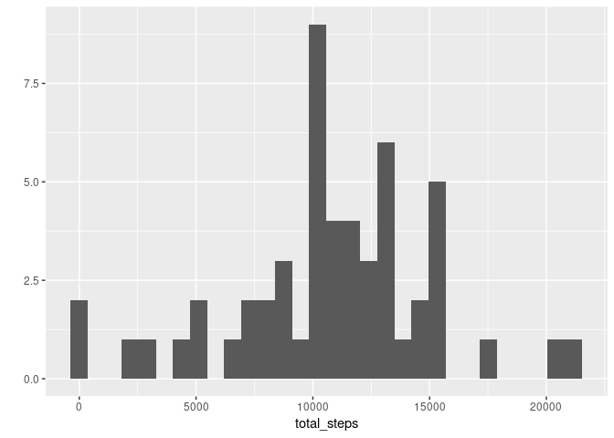
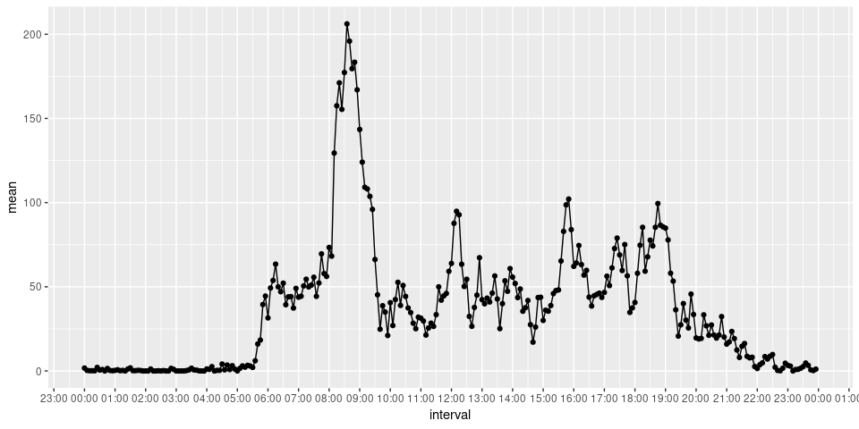
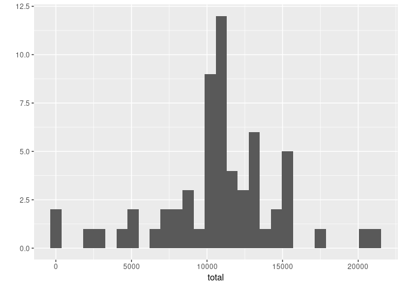
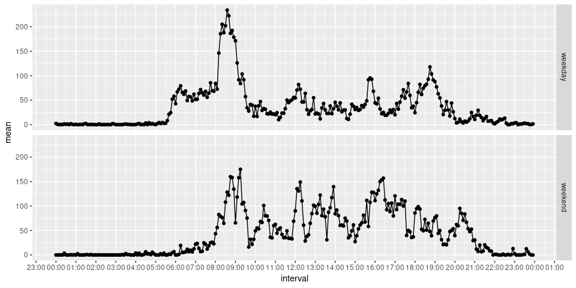

For the analysis, I will use the **data.table** and **dplyr** packages. 


```r
library(data.table)
library(dplyr)
foo <- fread("./activity.csv")
```

Using the **lubridate** package to work with date variable:


```r
library(lubridate)
foo <- foo %>% 
    mutate(date = ymd(date)) %>% 
    as.data.table()
```


I will use the **ggplot2** package to plot a histogram of the total number of steps
taken each day:


```r
library(ggplot2)
qplot(data = foo[, .(total_steps = sum(steps)), by = "date"], 
      x = total_steps, 
      geom = c("histogram"))
```




Next, let's take the mean and median of the number of steps taken each day. As 
there are days with no recorded number of steps, I will omit days with *NA*:


```r
steps_per_day <- foo[, .(total = sum(steps)), by = "date"] %>% 
    summarize(mean = mean(total, na.rm = T),
              median = median(total, na.rm = T))
steps_per_day
```

```
      mean median
1 10766.19  10765
```

According to previous results, the average/median steps taken per day was almost 
the same. 


Now, let's plot a time series of the average number of steps taken  in the 5-minute
interval:


```r
library(stringr)
library(hms)

foo <- foo %>% 
    mutate(interval = str_pad(as.character(interval), width = 4, side = "left", pad = "0")) %>% 
    as.data.table()

foo <- foo %>% 
    mutate(interval = paste(str_sub(interval, 1, 2), str_sub(interval, 3, 4), sep = ":"))%>% 
    as.data.table()

foo <- foo %>% 
    mutate(interval = hms::parse_hm(interval)) %>% 
    as.data.table()

foo[, .(mean = mean(steps, na.rm = T)), by = .(interval)] %>% 
    mutate(interval = as_datetime(interval)) %>% 
    ggplot(data = ., aes(x = interval, y = mean)) + 
    geom_point() + geom_line() + 
    scale_x_datetime(breaks = scales::date_breaks("1 hour"),
                     date_labels = "%H:%M")
```



As we can see from the previous plot, in average people seem to walk more during 
8-10h in the morning. 
Let's find the 5-minute interval that, on average, contains the maximum number of steps,


```r
foo[, .(mean = mean(steps, na.rm = T)), by = .(interval)] %>% 
    arrange(-mean) %>% 
    as.data.table %>% 
    head(1)
```

```
   interval     mean
1: 08:35:00 206.1698
```

That is it. Around 8:30 is the time the people walk more in average. 


## Missing Values:

Missing values is an issue in this data set. Let's see the how many rows exist with NA
values:

```r
foo[!complete.cases(foo)] %>% nrow
```

```
[1] 2304
```

So, from 17568 there are 2304 rows with NA values. 
That is around 13.1 percent of the 
data set.

Now, let's investigate the proportion of *NA* values in each variable:

```r
prop_NA <- sapply(foo, function(x) mean(is.na(x)))
prop_NA
```

```
    steps      date  interval 
0.1311475 0.0000000 0.0000000 
```


Let's further investigate the proportion in each day *steps* variable has *NA* 
value:


```r
prop_NA_by_day <- foo[, .(prop_NA = mean(is.na(steps))), by = .(date)]
prop_NA_by_day
```

```
          date prop_NA
 1: 2012-10-01       1
 2: 2012-10-02       0
 3: 2012-10-03       0
 4: 2012-10-04       0
 5: 2012-10-05       0
 6: 2012-10-06       0
 7: 2012-10-07       0
 8: 2012-10-08       1
 9: 2012-10-09       0
10: 2012-10-10       0
11: 2012-10-11       0
12: 2012-10-12       0
13: 2012-10-13       0
14: 2012-10-14       0
15: 2012-10-15       0
16: 2012-10-16       0
17: 2012-10-17       0
18: 2012-10-18       0
19: 2012-10-19       0
20: 2012-10-20       0
21: 2012-10-21       0
22: 2012-10-22       0
23: 2012-10-23       0
24: 2012-10-24       0
25: 2012-10-25       0
26: 2012-10-26       0
27: 2012-10-27       0
28: 2012-10-28       0
29: 2012-10-29       0
30: 2012-10-30       0
31: 2012-10-31       0
32: 2012-11-01       1
33: 2012-11-02       0
34: 2012-11-03       0
35: 2012-11-04       1
36: 2012-11-05       0
37: 2012-11-06       0
38: 2012-11-07       0
39: 2012-11-08       0
40: 2012-11-09       1
41: 2012-11-10       1
42: 2012-11-11       0
43: 2012-11-12       0
44: 2012-11-13       0
45: 2012-11-14       1
46: 2012-11-15       0
47: 2012-11-16       0
48: 2012-11-17       0
49: 2012-11-18       0
50: 2012-11-19       0
51: 2012-11-20       0
52: 2012-11-21       0
53: 2012-11-22       0
54: 2012-11-23       0
55: 2012-11-24       0
56: 2012-11-25       0
57: 2012-11-26       0
58: 2012-11-27       0
59: 2012-11-28       0
60: 2012-11-29       0
61: 2012-11-30       1
          date prop_NA
```

As we can see, the *NA* values when they appear, appear the whole day.  

To overcome this *NA* problem, let's fill in with the mean of steps over the 
period:


```r
foo2 = copy(foo)
foo2[is.na(steps), steps := mean(foo$steps, na.rm = T)]
```

```
Warning in `[.data.table`(foo2, is.na(steps), `:=`(steps, mean(foo$steps, :
Coerced 'double' RHS to 'integer' to match the column's type; may
have truncated precision. Either change the target column ['steps'] to
'double' first (by creating a new 'double' vector length 17568 (nrows of
entire table) and assign that; i.e. 'replace' column), or coerce RHS to
'integer' (e.g. 1L, NA_[real|integer]_, as.*, etc) to make your intent
clear and for speed. Or, set the column type correctly up front when you
create the table and stick to it, please.
```

```r
foo2
```

```
       steps       date interval
    1:    37 2012-10-01 00:00:00
    2:    37 2012-10-01 00:05:00
    3:    37 2012-10-01 00:10:00
    4:    37 2012-10-01 00:15:00
    5:    37 2012-10-01 00:20:00
   ---                          
17564:    37 2012-11-30 23:35:00
17565:    37 2012-11-30 23:40:00
17566:    37 2012-11-30 23:45:00
17567:    37 2012-11-30 23:50:00
17568:    37 2012-11-30 23:55:00
```

As we can see from the warning messages, as the mean of steps is a float number and 
steps variable is an integer type, there is an implicit coercion of the float to integer
inside the data.table. If we wanted not to happen this coercion, we would first transform 
steps variable to float and then apply the mean imputation. For the purpose of this 
projejct assignment, I will let it as it is. 

Now, let's see how the mean imputation changed the results we got so far. See the 
histogram of the total number of steps taken each day after missing values are imputed:


```r
foo2[, .(total = sum(steps)), by = "date"] %>% 
    qplot(data = ., x = total, geom = "histogram")
```



It does not seem that different, right?

Let's calculate the mean and median total number of steps taken per day and see
how they differ:


```r
foo2[, .(total = sum(steps)), by = .(date)] %>% 
    summarize(mean = mean(total), median = median(total))
```

```
      mean median
1 10751.74  10656
```

With the mean imputation, we see that the average and median steps taken per day are
smaller than before.


Now let's investigate if there is any change on the activity pattern between 
weekdays and weekends.

First, let's create a variable called *type_day* that specify if that date is weekday or
weekend. Then, we will plot the series for each *type_day*:


```r
foo <- foo %>% 
    mutate(type_day = ifelse(weekdays(date) == "Sunday" | weekdays(date) == "Saturday", "weekend", "weekday")) %>% 
    as.data.table()

foo[, .(mean = mean(steps, na.rm = T)),  by = .(interval, type_day)] %>% 
    mutate(interval = as_datetime(interval)) %>% 
    ggplot(data = ., aes(x = interval, y = mean)) +
    geom_line() + geom_point() + 
    facet_grid(rows = vars(type_day)) + 
    scale_x_datetime(breaks = scales::date_breaks("1 hour"),
                     date_labels = "%H:%M")
```



From the previous plot, we can that during weekends, people do not seem to take
much steps during the 6-8 hours in the morning. Also, the average steps taken has 
a smaller variance during the 8-21h in the weekend compared to week days.

    
